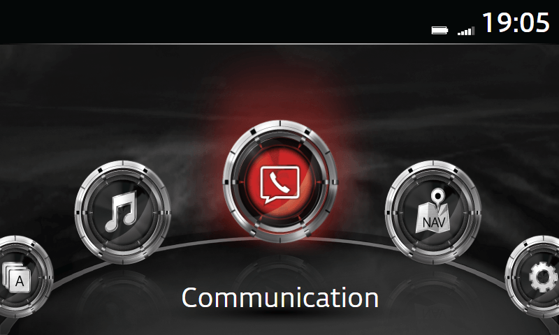

# mzd-emu — Mazda Connect (JCI-IHU) Emulator

This project lets you run the Mazda Connect (JCI-IHU) head unit's UI on your
own computer, in a regular modern browser such as Chrome — no head unit or
special hardware required. It is based on firmware version **74.00.324 EU N**.

<p align="center">
  
</p>

> [!WARNING]
> This is an emulator, not the real head unit software: not every function
> is implemented, and some behavior may be incomplete or inaccurate compared
> to a real vehicle.

It works by running two small local servers:

- `server/ui-server.js` — serves the original head unit GUI in your browser
  and patches it so it works outside the real hardware.
- `server/mmui-server.js` — stands in for the head unit's internal software,
  answering the GUI's requests (screen navigation, status bar, settings,
  etc.) so the interface behaves like it does in the car.

https://github.com/user-attachments/assets/ef45d208-f471-477d-8029-747deec10643

## Installation

1. Install [Node.js](https://nodejs.org) 20.19 or newer.
2. Clone this repository.
3. Install dependencies from the project root:

    ```bash
    npm install
    ```

4. Add an extracted `jci/` firmware dump to the project root. It is not
   included in the repository.

Expected structure:

```text
mzd-emu/
├── jci/          # firmware dump you add — the only thing not in the repo
├── server/
├── ...
```

## Running

Both servers must be running at the same time. From the project root:

```bash
npm start
```

This runs [`server/start-all.js`](server/start-all.js), which starts both
servers together in one terminal and stops both together on Ctrl+C.

Open <http://localhost:8080/jci/gui/index.html> after the servers start.

You can also run them separately (e.g. in two terminals, to see each one's
logs on its own):

```bash
npm run mmui   # WebSocket MMUI/UIA transport
npm run ui     # firmware GUI HTTP server
```

## Controls

The real head unit is operated with a rotary controller you tilt in 4
directions, push, and rotate, plus a separate Back button. The keyboard maps
to that same controller, matching the firmware's own input handling in
`jci/gui/common/js/Multicontroller.js`.

| Key(s)          | Emulates                                                       |
| --------------- | -------------------------------------------------------------- |
| `←` `→` `↑` `↓` | Tilting the rotary knob in that direction                      |
| `Enter`         | Pushing (clicking) the rotary knob                             |
| `N`             | Rotating the knob counter-clockwise                            |
| `M`             | Rotating the knob clockwise                                    |
| `Backspace`     | Pressing the dedicated **Back** button next to the rotary knob |

**Home button:** there is no keyboard shortcut for it — click the on-screen
Home icon in the status bar instead.

## Configuration

The emulator has three separate, independent configuration layers. Each one
covers a different concern, and none of them overlap.

### Runtime ports

[`server/config/runtime.json`](server/config/runtime.json) controls which
local ports the servers listen on. Edit it and restart the servers to
change a port.

| Key          | Default | Used for                                |
| ------------ | ------- | --------------------------------------- |
| `uiPort`     | `8080`  | HTTP server serving the firmware GUI    |
| `guiifmPort` | `2700`  | WebSocket transport — GUI context/focus |
| `appsdkPort` | `2800`  | WebSocket transport — App SDK           |
| `dbapiPort`  | `2766`  | WebSocket transport — DB API            |

### Vehicle profile

[`server/config/vehicle.json`](server/config/vehicle.json) describes the
virtual car itself: region, vehicle model, HUD type, and which hardware
features are fitted (navigation SD card, Bose audio, Apple CarPlay, Android
Auto). This is fixed vehicle identity, not something the driver changes from
the UI — edit it to simulate a different market or equipment level, then
restart the servers.

### User settings

Everything the driver can actually change from the GUI (language, units,
door lock behavior, HUD brightness, driving-assist toggles, maintenance
distances, audio levels, etc.) is user settings, not vehicle configuration.

- These are saved automatically to
  [`server/data/user-settings.json`](server/data/user-settings.json)
  whenever you change something in the UI.
- They persist across restarts — closing and restarting the servers, or
  your browser, keeps whatever you last set.
- Delete the file (or edit values in it directly) to reset settings back to
  the emulator's defaults; it will be recreated on the next change.

## `server/` structure

- `mmui-server.js` is the native MMUI/UIA transport entry point.
- `ui-server.js` serves the GUI and injects polyfills.
- `start-all.js` starts both servers and stops them together.
- `mmui/` contains handlers named after firmware `uiaId` values from
  `jci/mmui/mmui_config.xml`, such as `system`, `syssettings`,
  `vehsettings`, `audiosettings`, `btpairing`, `netmgmt`, `sysupdate`,
  `schedmaint`, and `ecoenergy`.
- `config/` and `data/` hold the configuration described above.
- `ui-polyfills.html` contains browser compatibility shims for the old
  Presto-era GUI (see "How patching works" below).

### How patching works

`jci/` is a read-only firmware dump and is never modified on disk. Instead,
when `ui-server.js` serves `jci/gui/index.html`, it reads the file, inserts
the contents of `ui-polyfills.html` right before `</head>`, and serves that
combined HTML in the HTTP response — the original file on disk is untouched.
`ui-polyfills.html` does not change any GUI logic; it only adds polyfills
(shims) for old browser APIs the firmware's Presto-era JavaScript relies on,
so that unmodified GUI code can run in a modern browser like Chrome.

## Checks and formatting

Run all project checks with:

```bash
npm run check
```

This runs Prettier, ESLint, and the Node.js test suite. Individual commands
are also available:

```bash
npm run format
npm run format:check
npm run lint
npm run test
```

Both servers print their logs to the console while running.

## Disclaimer

This is an unofficial, community-developed emulator created for
interoperability, research, and learning purposes. It is not affiliated
with, endorsed by, sponsored by, or in any way associated with Mazda Motor
Corporation, Visteon, or any of their subsidiaries or affiliates. "Mazda",
"Mazda Connect", and any other trademarks mentioned are used only
descriptively, to identify the hardware/software this project is compatible
with — no trademark rights are claimed.

This repository does not contain or distribute any Mazda/JCI-IHU firmware.
Use this project at your own risk; it is provided "as is", without warranty
of any kind, under the [MIT License](LICENSE).
